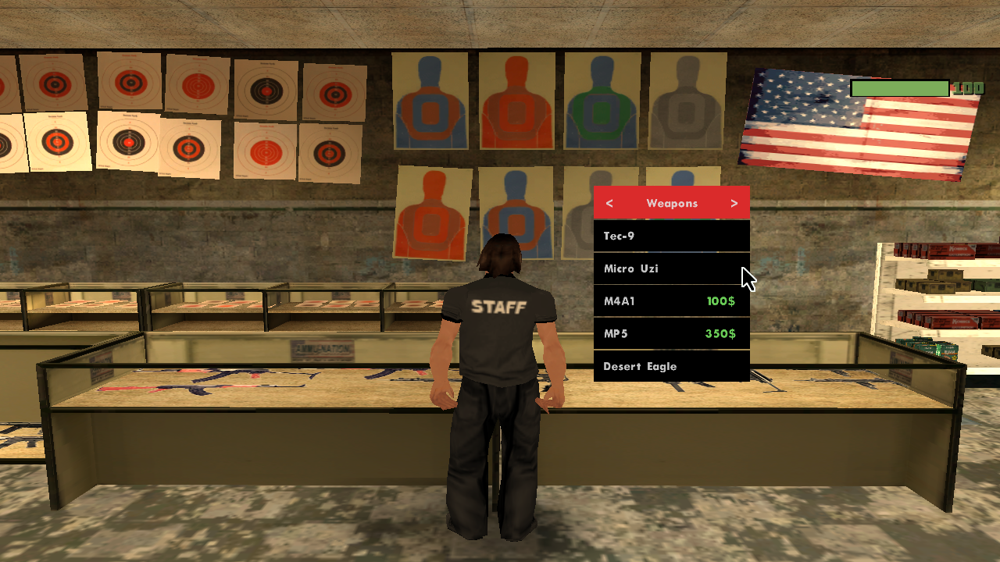
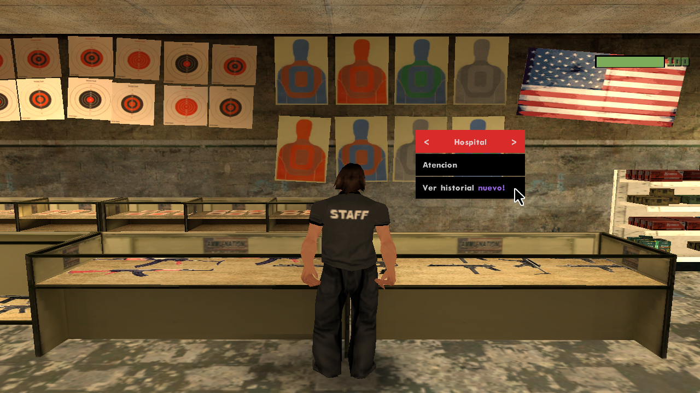
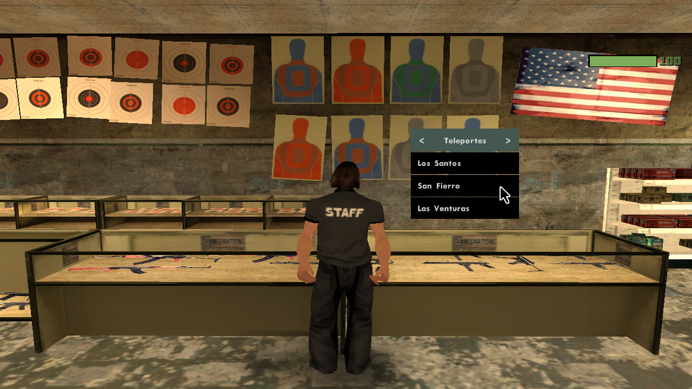

<h1 align="center">Menu Floating</h1>

Library for [sa-mp](https://sa-mp.mp) and [open.mp](https://open.mp)

<p align="center">
    
</p>

<h3 align="center">* Hello, this menu floating originally created by dotdue has been modified by Straydet. The original work belongs entirely to dotdue, and all credits go to him for the initial development.  
This version includes my own modifications and improvements.
</h3>

### Functions

```pawn
ShowMenuFloatingForPlayer(playerid, extraid, const header[], header_colour, const list_items[][]);
HideMenuFloatingForPlayer(playerid);
```

### Callbacks

```pawn
public OnPlayerMenuFloatingResponse(playerid, extraid, bool:response, listitem)
{
    return 1;
}
```

## Screenshots
<p align="center">
    
</p>

<p align="center">
    
</p>


## How do I use it?
<h3 align="center">You can use the cursor to select any option from the menu.</h3>

<p align="center">
    
</p>

### Example

```pawn
#define FILTERSCRIPT
#include <a_samp>
#include <zcmd>
#include <menu-floating>

enum
{
    MENU_FLOATING_HOSPITAL,
    MENU_FLOATING_TELEPORTES,
    MENU_FLOATING_WEAPONS,
}

CMD:hospital(playerid)
{
    static const items[][] =
    {
        "Atencion",
        "Ver historial ~p~nuevo!"
    };
    ShowMenuFloatingForPlayer(playerid, MENU_FLOATING_HOSPITAL, "Hospital", 0xDA2B2BFF, items);
    return 1;
}

CMD:teleportes(playerid)
{
    static const items[][] =
    {
        "Los Santos",
        "San Fierro",
        "Las Venturas"
    };
    ShowMenuFloatingForPlayer(playerid, MENU_FLOATING_TELEPORTES, "Teleportes", 0x445750FF, items);
    return 1;
}


CMD:weapons(playerid)
{
    static const items[][] =
    {
	    "Tec-9",
	    "Micro Uzi",
	    "M4A1_____________~g~~h~~h~100$",
	    "MP5______________~g~~h~~h~350$",
	    "Desert Eagle"
    };
    ShowMenuFloatingForPlayer(playerid, MENU_FLOATING_WEAPONS, "Weapons", 0xDA2B2BFF, items);
    return 1;
}


public OnPlayerMenuFloatingResponse(playerid, extraid, bool:response, listitem)
{
    /*new string[128];
    format(string, sizeof string, "[DEBUG] extraid = %i, response = %s, listitem = %i", extraid, response ? ("true") : ("false"), listitem);
    SendClientMessage(playerid, 0xCDCDCDFF, string);*/

    switch (extraid)
    {
        //--------------------------------------------------------------------//
        case MENU_FLOATING_HOSPITAL:
        {
            if (!response)
                return 0;

            switch (listitem)
            {
                case 0: SendClientMessage(playerid, -1, "* Atencion");
                case 1: SendClientMessage(playerid, -1, "* Historial");
            }
        }
        //--------------------------------------------------------------------//
        case MENU_FLOATING_TELEPORTES:
        {
            if (!response)
                return 0;

            HideMenuFloatingForPlayer(playerid);

            switch (listitem)
            {
                case 0:
                {
                    SetPlayerPos(playerid, 1547.2209, -1681.7416, 13.5588);
                    SetPlayerFacingAngle(playerid, 90.0);
                }
                case 1:
                {
                    SetPlayerPos(playerid, -1583.6185, 809.6888, 6.8203);
                    SetPlayerFacingAngle(playerid, 270.0);
                }
                case 2:
                {
                    SetPlayerPos(playerid, 1592.3444, 1817.8513, 10.8203);
                    SetPlayerFacingAngle(playerid, 360.0);
                }
            }

            SetPlayerInterior(playerid, 0);
            SetPlayerVirtualWorld(playerid, 0);
        }
        //--------------------------------------------------------------------//
		case MENU_FLOATING_WEAPONS:
		{
		    if (!response)
		        return 0;

		    HideMenuFloatingForPlayer(playerid);

		    switch (listitem)
		    {
		        case 0: // Tec-9 - gratis
		        {
		            GivePlayerWeapon(playerid, 32, 164);
		            SendClientMessage(playerid, -1, "* Has obtenido una Tec-9 Gratis!");
		        }
		        case 1: // Micro Uzi - gratis
		        {
		            GivePlayerWeapon(playerid, 28, 1000);
		            SendClientMessage(playerid, -1, "* Has obtenido una Micro Uzi Gratis!");
		        }
		        case 2: // M4A1 - 100$
		        {
		            new precio = 100;
		            new dinero = GetPlayerMoney(playerid);

		            if (dinero >= precio)
		            {
		                GivePlayerWeapon(playerid, 31, 500); // M4A1
		                GivePlayerMoney(playerid, -precio);
		                SendClientMessage(playerid, -1, "* Has comprado un M4A1 por 100$");
		            }
		            else
		            {
		                new faltante = precio - dinero;
		                new msg[64];
		                format(msg, sizeof msg, "* Te falta %d$ para comprar el M4A1", faltante);
		                SendClientMessage(playerid, 0xFF0000FF, msg);
		            }
		        }
		        case 3: // MP5 - 350$
		        {
		            new precio = 350;
		            new dinero = GetPlayerMoney(playerid);

		            if (dinero >= precio)
		            {
		                GivePlayerWeapon(playerid, 29, 500); // MP5
		                GivePlayerMoney(playerid, -precio);
		                SendClientMessage(playerid, -1, "* Has comprado un MP5 por 350$");
		            }
		            else
		            {
		                new faltante = precio - dinero;
		                new msg[64];
		                format(msg, sizeof msg, "* Te falta %d$ para comprar el MP5", faltante);
		                SendClientMessage(playerid, 0xFF0000FF, msg);
		            }
		        }
		        case 4: // Desert Eagle - gratis
		        {
		            GivePlayerWeapon(playerid, 24, 1000);
		            SendClientMessage(playerid, -1, "* Has obtenido una Desert Eagle Gratis!");
		        }
		    }
		}
		//--------------------------------------------------------------------//
    }
    return 1;
}
```


## Credits
- Developer (Straydet) -> (Added features and improvements)
- [Download - Original](https://github.com/dotdue/menu-floating/tree/main) -> (dotdue)
